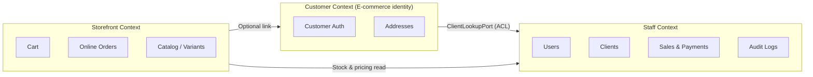
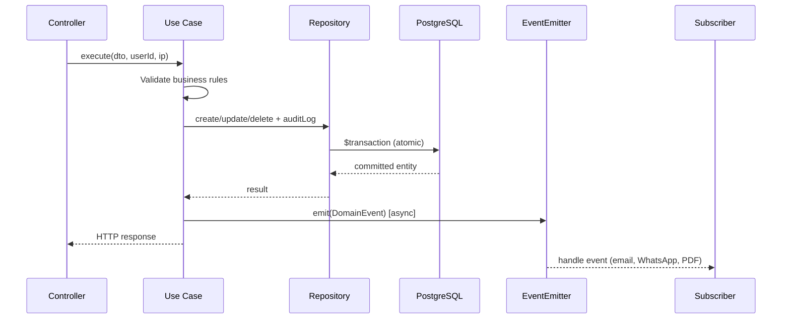

# Architecture

## Layer model

The system follows **Clean Architecture** with strict dependency direction: outer layers depend on inner layers, never the reverse.

```
HTTP Request
     │
     ▼
┌─────────────────────────────────────────┐
│  Presentation                           │
│  Routers · Controllers · Middlewares      │
│  — Parses HTTP, validates DTOs, maps     │
│    responses. No business rules.          │
└─────────────────┬───────────────────────┘
                  │
                  ▼
┌─────────────────────────────────────────┐
│  Domain                                 │
│  Use Cases · Entities · DTOs · Ports    │
│  — All business rules live here.        │
│    Zero imports from Express or Prisma. │
└─────────────────┬───────────────────────┘
                  │
                  ▼
┌─────────────────────────────────────────┐
│  Infrastructure                         │
│  Prisma Datasources · Adapters · Jobs   │
│  — Implements ports defined by domain.  │
└─────────────────────────────────────────┘
```

## Bounded contexts

Three contexts coexist in one monolith, isolated by domain boundaries:



The **Anti-Corruption Layer** (`ClientLookupPort`) exposes only `ClientSummary` (id, creditLimit, balance, isLinkedToCustomer) to the Customer context — never `ClientRepository` or `ClientEntity`.

## Financial write flow

Every balance-changing operation follows the same contract:



If the transaction fails, **both** the financial write and the audit log roll back. Subscribers only run **after** commit — a failed email never affects the ledger.

## Side effects via Domain Events

| Event | Trigger | Subscriber action |
|-------|---------|-------------------|
| `PAYMENT_REGISTERED` | Payment committed | Email + WhatsApp payload |
| `CREDIT_SALE_CREATED` | Credit sale committed | Email + WhatsApp payload |
| `CLIENT_NOTIFY_REQUESTED` | Staff requests statement | Email with PDF attachment |
| `CUSTOMER_PASSWORD_RESET` | Admin/forgot password | Email with temp password |

Subscribers are the **only** place where Nodemailer, Meta WhatsApp, or PDF generation are invoked. Use cases depend on `EventEmitterPort`, not concrete services.

## Async processing

```
                    ┌──────────────────┐
  Domain Event ───► │ BullMQ Queue     │ ───► notification.worker.ts
                    │ (if REDIS_URL)   │
                    └────────┬─────────┘
                             │ fallback if Redis down
                             ▼
                    Inline execution in subscriber
```

## Idempotency

Financial POST endpoints accept an `Idempotency-Key` header:

1. Hash request body (SHA-256)
2. Lookup `IdempotencyRecord` by key
3. If exists with same hash → return cached response
4. If exists with different hash → 409 Conflict
5. Else → process and store response

Applies to: sales creation, payment creation, online order checkout.

## Multi-mode deployment

Feature flags in PostgreSQL control which route groups are active. See [operation-modes.md](operation-modes.md).

Modes include **HYBRID** (full retail + e-commerce), **ECOMMERCE_ONLY** (credit routes return 404), and **POS_INTEGRATED** (preparation for external inventory source).
